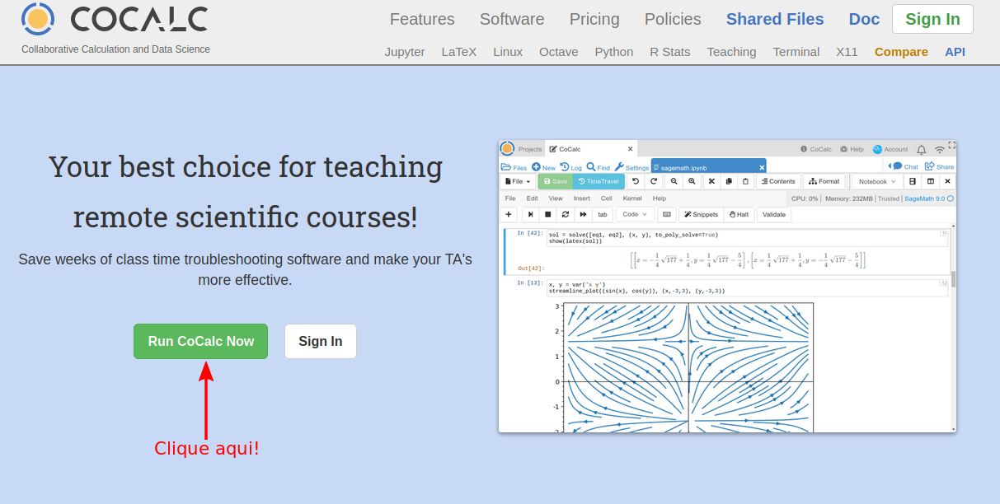
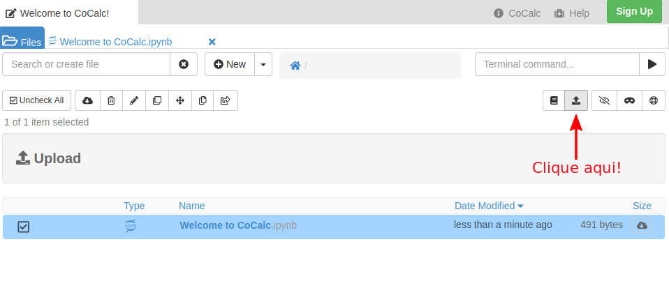
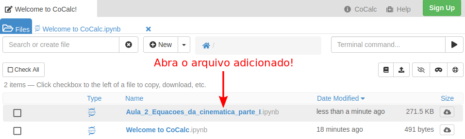

# Curso de Extensão 📚

Bem vindo ao curso de extensão oferecido pelo <a href='http://site.dfi.uem.br/' target='_blank'>Departamento de Física (DFI)</a> da <a href='http://www.uem.br/' target='_blank'>Universidade Estadual de Maringá (UEM)</a>. 

Esse curso será dedicado ao aprendizado de ferramentas básicas da linguagem de programação <a href='https://www.python.org/' target='_blank'><mark class='mono_gray'>Python</mark></a>. Essas serão utilizadas para analisar e interpretar dados provenientes de experimentos de física básica. O curso é de caráter introdutório, portanto, se aplicando em casos simples como o movimento retilíneo uniforme (MRU) e o movimento retilíneo uniformemente variável (MRUV). Esses são os primeiros experimentos estudados e executados na disciplina de <a href='http://site.dfi.uem.br/wp-content/uploads/2016/10/3057-Lab.-Fisica-Geral-I-programa-2007.pdf' target='_blank'>Laboratório de Física Geral I/Física Experimental I</a>, oferecida pelo DFI, baseada no <a heref='http://site.dfi.uem.br/wp-content/uploads/2018/04/Manual-de-Laborat%C3%B3rio-de-F%C3%ADsica-Experimental-I.pdf' target='_blank'>Manual de laboratório de Física Experimental I</a>

# Conteúdo do Curso

Durante o curso, abordaremos conceitos de física básica e analisaremos alguns experimentos. Nosso objetivo é detalhar as observações feitas e criar modelos que expliquem os fenômenos observados. As análises dos dados serão feitas na linguagem de programação <a href='https://www.python.org/' target='_blank'><mark class='mono_gray'>Python</mark></a> 🐍. Iremos apresentar o básico de como:

<ul>
    <li>estruturar os dados com a biblioteca <a href='https://pandas.pydata.org/' target='_blank'><mark class='mono_gray'>pandas</mark></a> 🐼 e <a href='https://numpy.org/' target='_blank'><mark class='mono_gray'>numpy</mark></a>;
        <li class='ident'>o uso dessas bibliotecas nos permite uma visualização melhor dos dados;</li>
        <li class='ident'>elas permitem uma facilidade na implementação de funções necessárias para nossas análises, como calcular média e desvio padrão;</li>
    </li>
    <!--  -->
    <li> confeccionar gráficos usando o pacote <a href='https://matplotlib.org/' target='_blank'><mark class='mono_gray'>matplotlib</mark></a> 📈;
        <li class='ident'>a partir de gráficos podemos ver tendências nos dados e então sugerir modelos;</li>
        <li class='ident'>inspecionar visualmente a concordância entre os dados e o modelo proposto;</li>
    </li>
    <!--  -->
    <li> fazer ajustes lineares 📐;
        <li class='ident'>ajustar a equação da reta, obtendo os coeficientes linear e angular;</li>
    </li>
    <!--  -->
    <li> fazer ajustes não lineares;
        <li class='ident'>trabalharemos também com modelos não lineares, como polinômios;</li>
    </li>
    <!--  -->
    <li> os ajustes serão feitos usando as função <a href="https://numpy.org/doc/stable/reference/generated/numpy.polyfit.html" target="_blank"><mark class='mono_gray'>polyfit()</mark></a> do <mark class='mono_gray'>numpy</mark> e <a href="https://docs.scipy.org/doc/scipy/reference/generated/scipy.optimize.curve_fit.html" target="_blank"><mark class='mono_gray'>optimize.curve_fit()</mark></a> do <a href="https://docs.scipy.org/doc/scipy/reference/index.html" target="_blank"><mark class='mono_gray'>scipy</mark></a>;</li>
    <li> veremos também, brevemente, como fazer uma regressão linear usando pacote de <i>machine learning</i> 🤖 <a href='https://scikit-learn.org/stable/' target='_blank'><mark class='mono_gray'>sklearn</mark></a>;
    </li>
    <!--  -->
    <li> analisar quantitativamente a qualidade do modelo;
        <li class='ident'>calcularemos o desvio percentual de quantidades físicas envolvidas;</li>
        <li class='ident'>calcularemos o coeficiente de determinação.</li>
    </li>
</ul>

<!-- 
- estruturar os dados com a biblioteca <a href='https://pandas.pydata.org/'><mark class='mono_gray'>pandas</mark></a> :panda_face: e <a href='https://numpy.org/'><mark class='mono_gray'>numpy</mark></a>;
    - o uso dessas bibliotecas nos permite uma visualização melhor dos dados;
    - elas permitem uma facilidade na implementação de funções necessárias para nossas análises, como calcular média e desvio padrão;

- confeccionar gráficos usando o pacote [``matplotlib``](https://matplotlib.org/) :chart_with_upwards_trend:;
    - a partir de gráficos podemos ver tendências nos dados e então sugerir modelos teóricos;
    - inspecionar visualmente a concordância entre os dados e o modelo proposto;

- fazer ajustes lineares :triangular_ruler:;
    - ajustar a equação da reta, obtendo os coeficientes linear e angular;

- fazer ajustes não lineares;
    - trabalharemos também com modelos não lineares, como polinômios de grau dois;

- aprender a ajustar modelos usando a função ``polyfit`` do ``numpy`` e usando pacote de *machine learning* [``sklearn``](https://scikit-learn.org/stable/);

- analisar quantitativamente a qualidade do modelo;
    - calcularemos o desvio percentual de quantidades físicas envolvidas;
    - calcularemos o coeficiente de determinação.
-->

Mas e a Física? 🤔

Como dito antes, iremos abordar o tema de cinemática, o que consiste a primeira parte das disciplinas de Física Geral I de qualquer curso. Ela serve de base para entendermos a dinâmica dos movimentos mais simples, sendo esses:

<ul>
    <li><b>movimento retilíneo uniforme (MRU)</b>
        <li class='ident'>o objeto se desloca, em uma única dimensão, com velocidade constante e aceleração nula;</li>
    </li>
    <!--  -->
    <li><b>movimento retilíneo uniformemente variável (MRUV)</b>
        <li class='ident'>o objeto se desloca, em uma única dimensão, com velocidade variável e aceleração constante diferente de zero;</li>
    </li>
</ul>

<!-- - **movimento retilíneo uniforme (MRU)**
    - objeto se desloca, em uma única dimensão, com velocidade constante e aceleração nula;
- **movimento retilíneo uniformemente variável (MRUV)**
    - o objeto se desloca, em uma única dimensão, com velocidade variável e aceleração constante; -->

O estudo desses dois movimentos consiste basicamente no estudo de poucas equações:

<ul>
    <li align='justify'>a função horária da posição: ;</li>
    <li align='justify'>a função horária da velocidade: ;</li>
    <li align='justify'>a função horária da aceleração:  ;</li>
</ul>

<!-- - a função horária da posição: ;
-  a função horária da velocidade: ;
- a função horária da aceleração:  ; -->

Iremos entender o significado de cada uma dessas quantidades e como elas influenciam o movimento do sistema conforme o tempo passa. Para isso, iremos contar com a ajuda de gráficos que descrevem essas quantidades. Veja abaixo um gráfico dessas três quantidades. Você pode mudar os valores da <b style="color: #0095DD">posição inicial</b>, da <b style="color: #31A354">velocidade</b> e da <b style="color: #E34A33">aceleração</b> e já ir entendendo o que ocorre em cada tipo de movimento! 😃

 <iframe
  width="100%" height="100%"
  src="iterative_plots/mruv.html"
  frameborder="0" scrolling="no"
  style="position:absolute; top:0; left: 0">
  </iframe>

Vá criando uma intuição do que é ajustar um modelo aos dados. Começo com o exemplo simples de uma reta:

     

Tente mudar os parâmetros  e  para que o ajuste (<u style="text-decoration-style: dashed; color: #E34A33;">linha tracejada vermelha</u>) se aproxime o máximo dos dados (<u style="color: #0095DD;">linha sólida azul</u>)!

 <iframe
  width="100%" height="100%"
  src="iterative_plots/ajuste_mru.html"
  frameborder="0" scrolling="no"
  style="position:absolute; top:0; left: 0">
  </iframe>

<i>Caso esteja usando o celular, coloque-o na horizontal para melhor visualização.</i>
<iframe src="https://giphy.com/embed/hScapv64LYdZe2YO26" width="30" height="30" frameBorder="0" class="giphy-embed" allowFullScreen>
</iframe> 
 
Passando o mouse ou usando o <i>touch</i> do celular, você pode verificar o valor de cada ponto nos gráficos. 

Ao final das aulas, exercícios são fornecidos para que você possa treinar o que foi abordado. Não é necessário a entrega desses exercícios. A única finalidade é ter algo para treinar seus novos conhecimentos. Estarei disponível para sanar (ou pelo menos tentar) suas dúvidas e discutir sobre o assunto.

Ficou interessado? 😃

Veja abaixo como fazer o <i>download</i> desse repositório e como usar a plataforma onde executaremos os códigos de nossas aulas e atividades propostas.

# Obtendo o Repositório 📩

Você precisará do repositório para usar o <mark class='mono_gray'>Jupyter Notebook</mark> contendo os conteúdos das aulas. 

Para isso, basta clicar aqui: <a href='https://github.com/vieirads/Curso-de-extens-o/archive/master.zip' target='_blank'>Baixar repositório</a>. Se o link não funcionar, entre no <a href='https://github.com/vieirads/Curso-de-extensao' target='_blank'>repositório do GitHub</a> e clique em <mark style="color: #FFFFFF; background-color: #31A354; border: 1px solid #000000; border-radius: 5px; padding: 3px; font-weight: bold;">Clone or download</mark>, e em seguida clique em <mark style="background-color: #FFFFFF; color: #0095DD; border: 1px solid #000000; border-radius: 5px; padding: 3px; font-weight: bold;">Download ZIP</mark>. 

<figure align='center'>
    
    <figcaption><b>Fig. 1:</b> Fazendo o download dos arquivos.</figcaption>
</figure>

Salve o arquivo em um local que for mais apropriado e descompacte-o. 

# Pasta <mark class='mono_gray'>Aulas</mark> 📂

Nessa pasta você encontrará arquivos com a extensão <mark class='mono_gray'>.ipynb</mark>. Esses arquivos são os <mark class='mono_gray'>Notebooks</mark> que trabalharemos. Eles contêm textos com o básico da linguagem de programação <mark class='mono_gray'>Python</mark> (Aulas 1 e 2). Posteriormente, os conceitos abordados nas primeiras aulas são conciliados com o texto baseado no <a href='http://site.dfi.uem.br/wp-content/uploads/2018/04/Manual-de-Laborat%C3%B3rio-de-F%C3%ADsica-Experimental-I.pdf' target='_blank'>Manual de Laboratório de Física Experimental I</a> (Aulas 3 e 4). Esses arquivos contém instruções de como os dados experimentais podem ser analisados usando a linguagem de programação <mark class='mono_gray'>Python</mark>. Para que o aluno possa treinar o que foi abordado durante o curso, um <mark class='mono_gray'>Notebook</mark> com exercícios é disponibilizado.

# Usando os Notebooks 📔

O uso dos <mark class='mono_gray'>Notebooks</mark> será feito exclusivamente <i>online</i>, não precisando instalar nenhuma dependência em seu computador.

## Google Colab Notebook

Para fazer o uso dessa plataforma, basta clicar no link . Você só precisa estar "logado" com seu <mark class='mono_gray'>gmail</mark> para que possa adicionar os arquivos das aulas. Uma vez que estiver "logado" em sua conta, basta você clicar em <mark style="background-color: orange; color: #FFFFFF; border: 1px solid #000000; border-radius: 5px; padding: 3px; font-weight: bold;">Upload</mark>.

<figure align='center'>
     
    <figcaption><b>Fig. 2:</b> Adicionando arquivo ao Google Colab.</figcaption>
</figure>
<!--  -->

Quando a janela de diálogo abrir, selecione o arquivo da aula e clique em abrir. Após o arquivo ser carregado, você será redirecionado para o <mark class='mono_gray'>Notebook</mark>, onde poderá acompanhar o conteúdo da aula e executar seus códigos. 👏 

## CoCalc

Para fazer o uso dessa plataforma, basta clicar no link <a href='https://cocalc.com/' target='_blank'>CoCalc</a>. Não é necessário fazer o uso de login (<i>Sign in</i>) e nem instalar nenhuma dependência em seu computador. Quando você entrar, em <mark style="color: #FFFFFF; background-color: #31A354; border: 1px solid #000000; border-radius: 5px; padding: 3px; font-weight: bold;">Run CoCalc now</mark>.

<figure align='center'>
     
    <figcaption><b>Fig. 3:</b> Página inicial do CoCalc.</figcaption>
</figure>

<!--  -->

Após isso, você será redirecionado para uma outra página, mostrada na figura abaixo. Na seção <mark class='mono_gray'>Suggested Kernels</mark>, clique em <mark class='mono_gray'>File</mark> no canto superior esquerdo e então em <mark class='mono_gray'>Upload</mark>.

<figure align='center'>
    
    <figcaption><b>Fig. 4:</b> Selecionando o kernel no CoCalc.</figcaption>
</figure>
<!--  -->

Na próxima página, clique mais uma vez no botão de upload, no canto superior direito da tela.

<figure align='center'>
     
    <figcaption><b>Fig. 5:</b> Upload do Notebook no CoCalc.</figcaption>
</figure>
<!--  -->

Quando a janela de dialogo abrir, selecione o arquivo da aula e clique em abrir. Após o arquivo ser carregado, você verá que ele está disponível para ser aberto. 

<figure align='center'>
     
    <figcaption><b>Fig. 6:</b> Abrindo o arquivo adicionado no CoCalc.</figcaption>
</figure>
<!--  -->

Pronto! A partir daí começaremos nossas aulas. Espero que seja bastante útil e façam bom proveito do curso. Qualquer dúvida estou à disposição! 👋

