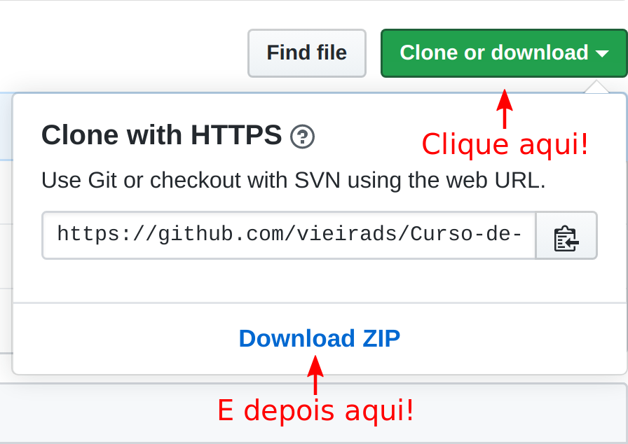

# Curso de extensão :books:

Bem vindo ao curso de extensão oferecido pelo [Departamento de Física (DFI)](http://site.dfi.uem.br/) da [Universidade Estadual de Maringá (UEM)](http://www.uem.br/). 

Esse curso será dedicado ao aprendizado de ferramentas básicas da linguaguem de programação [python](https://www.python.org/). Essas serão utilizadas para analisar e interpretar dados provenientes de experimentos de física básica. O curso é de caráter introdutório, portanto, estudaremos casos simples como o movimento retilíneo uniforme (MRU) e o movimento retilíneo uniformemente variável (MRUV). Esses são os primeiros experimentos estudados na disciplina de [Laboratório de Física Geral I](http://site.dfi.uem.br/wp-content/uploads/2016/10/3057-Lab.-Fisica-Geral-I-programa-2007.pdf),oferecida pelo DFI, que segue o [Manual de laboratório de Física Experimental I](http://site.dfi.uem.br/wp-content/uploads/2018/04/Manual-de-Laborat%C3%B3rio-de-F%C3%ADsica-Experimental-I.pdf). 

# Conteúdo do curso

Durante o curso, abordaremos conceitos de física básica e analisaremos experimentos. Nosso objetivo é detalhar as observações feitas e criar modelos que expliquem os fenômenos observados. A análise dos dados serão feitas na linguagem de programação ``python`` :snake:. Iremos aprender o básico de como:

- estruturar os dados com a biblioteca [``pandas``](https://pandas.pydata.org/) (:panda_face:) e [``numpy``](https://numpy.org/);
    - o uso dessas bibliotecas nos permite uma visualização melhor dos dados;
    - elas permitem uma facilidade na implementação de funções necessárias para nossas análises, como calcular média e desvio padrão;
<!--  -->
- confeccionar gráficos usando o pacote [``matplotlib``](https://matplotlib.org/) :chart_with_upwards_trend:;
    - a partir de gráficos podemos ver tendências nos dados e então sugerir modelos teóricos;
    - inspecionar visualmente a concordância entre os dados e o modelo proposto;
<!--  -->
- fazer ajustes lineares :triangular_ruler:;
    - ajustar a equação da reta, obtendo os coeficientes linear e angular;
<!--  -->
- fazer ajustes não lineares;
    - trabalharemos também com modelos não lineares, como polinômios de grau dois;
<!--  -->
- aprender a ajustar modelos usando a função ``polyfit`` do ``numpy`` e usando pacote de *machine learning* [``sklearn``](https://scikit-learn.org/stable/);
<!--  -->
- analisar quantitativamente a qualidade do modelo;
    - calcularemos o desvio percentual de quantidades físicas envolvidas;
    - calcularemos o coeficiente de determinação.

Ficou interessado? :smiley:
Veja abaixo como fazer o download desse repositório e como usar a plataforma onde executaremos os códigos de nossas aulas e atividades propostas.

# Obtendo o repositório :arrow_down:

Você precisará do repositório para usar o ``Jupyter Notebook`` contendo os conteúdos das aulas. 

Para isso, basta clicar aqui: [Baixar repositório](https://github.com/vieirads/Curso-de-extens-o/archive/master.zip). Se o link não funcionar, clique no botão verde, escrito ``Clone or download``, e então fazer o ``Download ZIP``. 

Salve o arquivo em um local que for mais apropriado e descompacte-o. 

# A pasta ``Aulas`` :open_file_folder:

Nessa pasta você encontrará arquivos com a extensão ``.ipynb``. Esses arquivos são os ``Notebooks`` que trabalharemos. Eles contêm textos baseado no [Manual de Laboratório de Física Experimental I](http://site.dfi.uem.br/wp-content/uploads/2018/04/Manual-de-Laborat%C3%B3rio-de-F%C3%ADsica-Experimental-I.pdf) e instruções de como os dados experimentais podem ser analisados usando a linguagem de programação ``python``.

# Usando os Notebooks :notebook_with_decorative_cover:

O uso dos ``Notebooks`` será feito exclusivamente online, não precisando instalar nenhum dependência em seu computador. Além disso, as plataformas sugeridas aqui "emprestam" um poder de computação para você.

# Google Colab notebook

Para fazer o uso dessa plataforma, basta clicar no link [Google Colab](https://colab.research.google.com/notebooks/intro.ipynb#recent=true). Você só precisa estar logado com seu ``gmail`` para que possa adicionar os arquivos das aulas. Uma vez que estiver logado em sua conta, basta você clicar em ``Upload``.

Quando a janela de dialogo abrir, selecione o arquivo da aula e clique em abrir. Após o arquivo ser carregado, você será redirecionado para o ``Notebook``, onde poderá acompanhar o conteúdo da aula e executar seus códigos. :clap: 

# CoCalc

Para fazer o uso dessa plataforma, basta clicar no link [CoCalc](https://cocalc.com/). Não é necessário fazer o uso de login (Sign in) e nem instalar nenhuma dependência em seu computador. Quando você entrar, clique no botão verde escrito ``Run CoCalc now``.

Após isso, você será redirecionado para uma outra página, mostrada na figura abaixo. Na seção ``Suggested Kernels``, clique em ``File`` no canto superior esquerdo e então em ``Upload``.

Na próxima página, clique mais uma vez no botão de upload, no canto superior direito da tela.

Quando a janela de dialogo abrir, selecione o arquivo da aula e clique em abrir. Após o arquivo ser carregado, você verá que ele está disponível para ser aberto. 

Pronto! A partir daí começaremos nossas aulas. Espero que todos aprendam algo e façam bom proveito do curso. :wave: